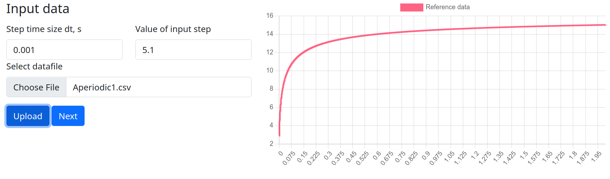
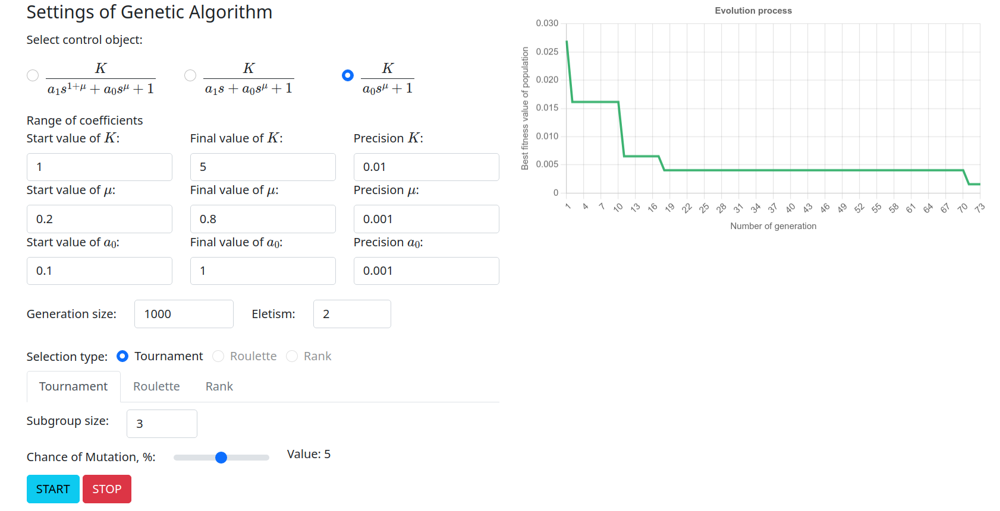

# foNamic 

### TODO:
* сделать вывод результатов оптимизации в табличку по пяти лучшим результатам после окончания аппроксимации;
* дать нескольким пользователям доступ к программе (логин);
* выбор между различными видами селекции и скрещивания;
* исправить элитизм (чтобы было возможно выбить больше единицы);
* сохранять данные оптимизации в базе данных (сохранять проекты и загружать);
* модернизировать интерфейс;
* выполнять расчеты в многопоточном режиме.